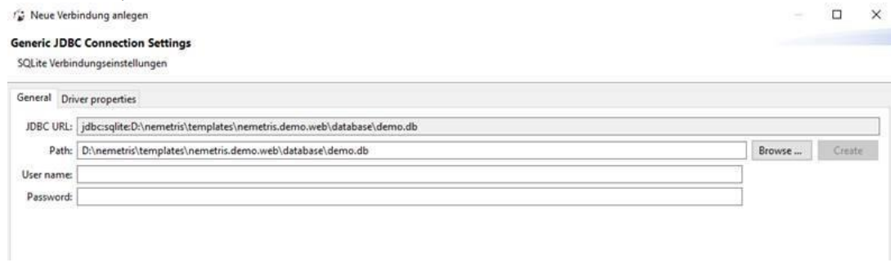

# nemetris simple webapp demo

This demo gives you a brief introduction into web application developemnt.
It shows you some simple features like..

* working with forms
* reading/writing from/to an sqlite3 database
* working with jquery UI examples
* working with jquery ajax calls

## Installation Instructions

* install git
* clone this repository `git clone https://github.com/nemetris/webdemo.git`
* install a python interpreter (python 3.9 or higher)
* install cherrypy webserver via pip `pip install cherrypy`

## Run Webapplication

Execute `start_demo.bat` to bring up the cherrypy webserver.
Open your browser and go the URL `http://localhost:4444` and inspect the application.

## Query Database

On startup a small sqlite3 database is going to be created. To inspect what's inside the database,
you can use the tool `DBeaver`. Simply download and run the application and follow the steps
described here `https://github.com/dbeaver/dbeaver/wiki/Create-Connection`.

## Links

* [dbeaver download](https://dbeaver.io/download/)
* [git download](https://git-scm.com/downloads)
* [Python download](https://www.python.org/downloads/release/python-3120/)
* [pip docs](https://pip.pypa.io/en/stable/)
* [cherrypy docs](https://docs.cherrypy.dev/en/latest/)
* [cherrypy tutorial](https://docs.cherrypy.dev/en/latest/tutorials.html)
* [cherrypy tutorial - database](https://docs.cherrypy.dev/en/latest/tutorials.html#tutorial-9-data-is-all-my-life)
* [jquery docs](https://api.jquery.com/)
* [w2ui docs](https://w2ui.com/web/docs/1.5/grid)
* [VS Code download](https://code.visualstudio.com/download)
* [VS Code SQLite Viewer](https://marketplace.visualstudio.com/items?itemName=qwtel.sqlite-viewer)
* [Python Code Formatter](https://github.com/nemetris/yapf)
* [JavaScript Code Formatter](https://eslint.org/)
